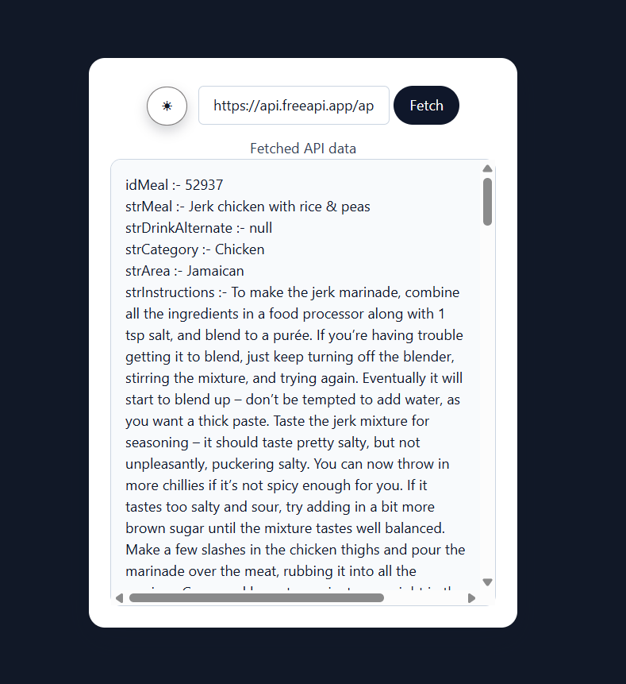

## Screenshot
### Application in Action



The screenshot above shows the application fetching data from a FreeAPI endpoint and dynamically rendering the response inside the browser.

## Data Processing Flow

When a user enters an API URL and clicks the Fetch button, the application:

1. Sends a GET request using the Fetch API.
2. Converts the response into JSON.
3. Attempts to locate the actual payload that contains useful data.
4. Normalizes the payload so that both object-based and array-based responses can be processed using the same rendering strategy.
5. Dynamically creates DOM elements and displays the response as key-value pairs inside the application.

## Rendering Strategy

The application does not rely on hardcoded property names such as `Name`, `Price`, or `Symbol`.

After extracting the payload from the API response, the application checks whether the payload is an object or an array. If it is an object, it is converted into an array so that both response types can be processed using the same rendering workflow.

```js
if (!Array.isArray(recvData)) {
    recvData = [recvData];
}
```

The application then iterates through every item in the payload and dynamically inspects its properties.

```js
for (const item of recvData) {
    for (const key in item) {
        // render property
    }
}
```

For each property discovered, a new DOM element is created at runtime and appended to the response container.

```js
const row = document.createElement("div");

row.textContent = `${key} :- ${item[key]}`;

dataContRF.append(row);
```

This dynamic approach allows the application to render data from different FreeAPI endpoints without creating endpoint-specific UI layouts or manually mapping response fields.

The rendered output follows the format:

```txt
Property Name :- Value
```

By combining payload normalization, object iteration, and dynamic DOM creation, the application can adapt to varying response structures while keeping the rendering logic simple and reusable.

## Prototype Notice

This project was primarily designed and tested using endpoints from **FreeAPI.app**.

During testing, most API responses followed one of these common payload structures:

- The useful data exists inside a nested `data` property.
- The useful data exists inside a nested `data.data` property.
- The useful data exists directly in the root response object.

The extraction logic is currently optimized for these commonly observed FreeAPI response formats.

Because only a limited set of API structures were tested, this project should currently be considered a **prototype API data fetcher and response viewer**, rather than a universal JSON explorer.

Some public APIs may contain:

- Deeply nested objects
- Arrays within arrays
- Different payload property names
- Recursive data structures
- Custom response formats

These cases may require additional parsing and rendering logic.

## Current Limitations

- Nested objects render as `[object Object]`
- No recursive JSON rendering
- No syntax highlighting
- Large responses can be difficult to read
- Assumes common FreeAPI response patterns
- No expandable/collapsible JSON tree

## Future Improvements

- Recursive nested-object rendering
- Better handling of deeply nested JSON
- Expandable JSON tree view
- Search/filter response data
- Loading spinner
- Improved error handling UI
- Copy-to-clipboard functionality
- JSON syntax highlighting
- API request history

## Key Concepts Practiced

- Fetch API
- DOM Manipulation
- Dynamic Rendering
- JSON Parsing
- Array and Object Iteration
- Optional Chaining
- Event Handling
  
## Live link
https://ashu73909.github.io/DOM-2-APIDataFetch-app/

## Author

Created by Ashu as a practice project for learning API integration and dynamic DOM rendering using JavaScript.
